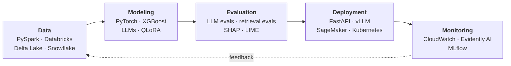

<div align="center">

# Anvesh Pavuluri

<a href="https://github.com/alphaap0990"></a>

<a href="https://www.linkedin.com/in/anveshp0990"></a>
<a href="https://portfolio-chi-pink-99.vercel.app/"></a>
<a href="mailto:anveshp1976@gmail.com"></a>

</div>

<br/>

```python
class AnveshPavuluri(MLEngineer):
    role       = "AI/ML Engineer — Generative AI & MLOps"
    experience = "4+ years"
    domains    = ["healthcare", "enterprise"]

    builds = {
        "genai":     ["RAG", "agentic workflows", "LLM fine-tuning", "LLM evaluation"],
        "ml":        ["risk prediction", "forecasting", "fraud detection", "recommendation"],
        "nlp_dl":    ["transformers", "clinical NER", "document intelligence", "computer vision"],
        "inference": ["FastAPI", "vLLM", "dynamic batching", "GPU optimization"],
        "mlops":     ["MLflow", "SageMaker", "CI/CD", "monitoring"],
        "data":      ["PySpark", "Databricks", "Delta Lake", "Snowflake"],
    }

    def philosophy(self):
        return "A model isn't done until it's deployed, evaluated, and monitored."
```

I work across the full ML lifecycle — shaping large-scale healthcare and enterprise data, building models from gradient-boosted trees to fine-tuned LLMs, and owning the serving, evaluation, and monitoring that keep them useful in production. The through-line is **Machine Learning + Generative AI + Software Engineering + MLOps**.

---

## 🔁 How I Work



---

## 🧩 What I Build

<table>
  <tr>
    <td width="33%" valign="top">
      <h4>🤖 GenAI & LLM Systems</h4>
      <sub>RAG · agentic systems · prompt engineering · structured generation · LLM evaluation · PEFT / LoRA · inference optimization</sub>
    </td>
    <td width="33%" valign="top">
      <h4>🔎 Retrieval & Search</h4>
      <sub>Hybrid search · dense retrieval · BM25 · embeddings · vector databases · reranking · retrieval evaluation</sub>
    </td>
    <td width="33%" valign="top">
      <h4>🧠 Machine Learning</h4>
      <sub>Classification · regression · forecasting · recommendation · risk prediction · survival analysis · fraud detection</sub>
    </td>
  </tr>
  <tr>
    <td width="33%" valign="top">
      <h4>🗣️ NLP & Deep Learning</h4>
      <sub>Transformers · BERT · RoBERTa · BioBERT · NER · text classification · computer vision</sub>
    </td>
    <td width="33%" valign="top">
      <h4>⚙️ MLOps & Serving</h4>
      <sub>Model serving · MLflow · CI/CD · Docker · Kubernetes · SageMaker Pipelines · CloudWatch · Evidently AI</sub>
    </td>
    <td width="33%" valign="top">
      <h4>☁️ Cloud & Data</h4>
      <sub>AWS · Azure · SageMaker · Bedrock · Databricks · PySpark · Delta Lake · large-scale processing</sub>
    </td>
  </tr>
</table>

---

## 💼 Experience

```text
* 2025-01 ── present   AI/ML Engineer   UnitedHealthcare
|
* 2023-02 ── 2024-12   AI/ML Engineer   Inspire Infosol Pvt Ltd.
```

### UnitedHealthcare
<sub>Generative AI, clinical NLP, and predictive ML for healthcare — HIPAA-compliant, evaluated, and monitored in production.</sub>

```diff
+ Clinical RAG over 400K+ pages of CMS guidelines — AWS Bedrock (Claude 3.5 Sonnet) + LangChain
+   ↳ 92% lower response latency · 42% lower token cost
+ Fine-tuned LLaMA 3.1 / Mistral with QLoRA + 4-bit quantization on SageMaker
+   ↳ 45K prior-authorization summaries · +27% medical-necessity extraction accuracy
+ LangGraph agentic workflows · BioBERT clinical NLP at F1 0.86
+ Claims risk models on 12M+ claims at 0.89 ROC-AUC — PySpark / Databricks over 5TB+, 2M+ records/day
+ Inference optimization: 3.8× GPU throughput · <80ms P99 latency · $24K/month infra savings
```

### Inspire Infosol Pvt Ltd.
<sub>Predictive ML, NLP, document intelligence, and computer vision for enterprise use cases — from training to serving.</sub>

```diff
+ Churn prediction & fraud detection at 0.84 F1, explained with SHAP / LIME
+ RoBERTa text classification at 91% accuracy
+ OCR + LayoutLMv3 document pipeline — 70% less manual document processing
+ Recommendations +18% cross-sell conversion · demand forecasting +22% replenishment accuracy
+ FastAPI + Docker serving with ONNX Runtime / TensorRT at <50ms · MLflow, DVC, Airflow
```

---

## 📈 Scale

<div align="center">

| `400K+` | `12M+` | `5TB+` | `2M+/day` | `3.8×` | `<80ms` |
|:-:|:-:|:-:|:-:|:-:|:-:|
| CMS guideline pages | claims analyzed | claims data processed | records processed | GPU throughput | P99 inference latency |

<sub>Scale of production systems I've worked on professionally.</sub>

</div>

---

## 🧰 Stack

<p align="center">
  
</p>

```yaml
languages_data:  [Python, SQL, Bash, Pandas, Polars, NumPy, PySpark, Databricks]
ml:              [Scikit-learn, XGBoost, LightGBM, CatBoost, Random Forest, Prophet, ARIMA]
dl_nlp:          [PyTorch, TensorFlow, Hugging Face Transformers, BERT, RoBERTa, BioBERT, spaCy, OpenCV, YOLOv8]
genai_llms:      [LangChain, LangGraph, LlamaIndex, AWS Bedrock, OpenAI API, LLaMA, vLLM, RAG, PEFT, LoRA]
retrieval:       [Pinecone, FAISS, pgvector, BM25, Qdrant]
mlops:           [MLflow, Weights & Biases, DVC, SageMaker, Docker, Kubernetes, FastAPI, GitHub Actions, GitLab CI/CD]
cloud_infra:     [AWS, Azure, Databricks, S3, Lambda, ECS, EKS, PostgreSQL, Snowflake]
```

---

## 🔭 Currently Exploring

```python
>>> anvesh.interests()
['production RAG', 'agentic AI', 'LLM evaluation', 'efficient fine-tuning',
 'LLM inference optimization', 'multimodal AI', 'model serving',
 'AI observability', 'retrieval optimization', 'MLOps']
```

---

## 🎓 Education

**M.S. Computer Science** · Purdue University Northwest<br/>
**B.Tech Computer Science / Data Science** · Gokaraju Rangaraju Institute of Engineering and Technology

---

<details>
<summary><b>📊 GitHub activity</b></summary>
<br/>
<p align="center">
  
  
</p>
</details>

---

<div align="center">

### Let's connect

Working on production ML, Generative AI, or AI infrastructure? I'm happy to talk shop.

[LinkedIn](https://www.linkedin.com/in/anveshp0990) · [Portfolio](https://portfolio-chi-pink-99.vercel.app/) · [GitHub](https://github.com/alphaap0990) · [anveshp1976@gmail.com](mailto:anveshp1976@gmail.com)

</div>
